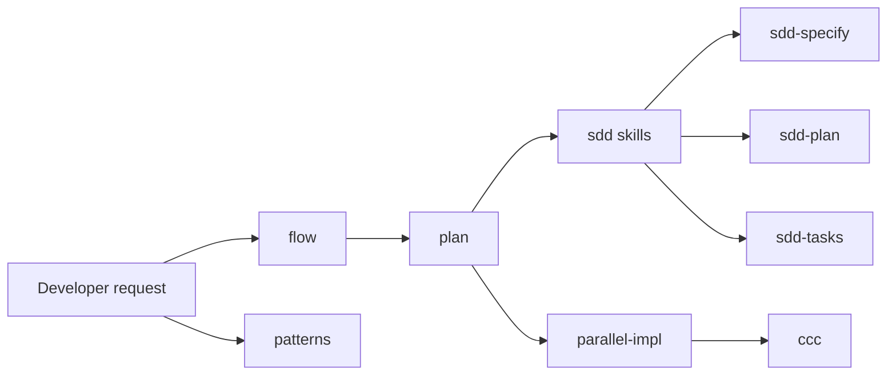

# Plugin Composition

`flow`, `ccc`, and `patterns` are separate plugins that can be installed independently or together.

## Composition model

## When to install multiple plugins

Install multiple plugins together when you want:

- planning with integrated SDD (specify, plan, tasks) via the unified flow plugin;
- clean-code enforcement and targeted review checks from ccc;
- PEAA pattern guidance from patterns;
- one repo-local marketplace source for all plugins.

## When to install only one

- Install only **`flow`** when you want execution, review-resolution, readiness workflows, and SDD together.
- Install only **`ccc`** when you want clean-code audits and enforcement without the workflow orchestration loops.
- Install only **`patterns`** when you want PEAA pattern guidance without workflow orchestration or code enforcement.
