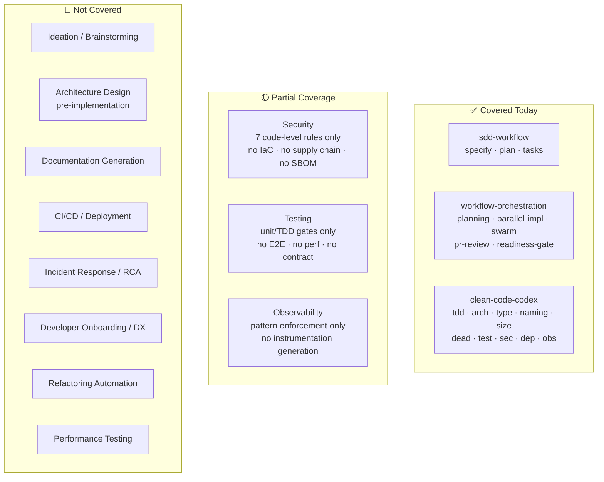
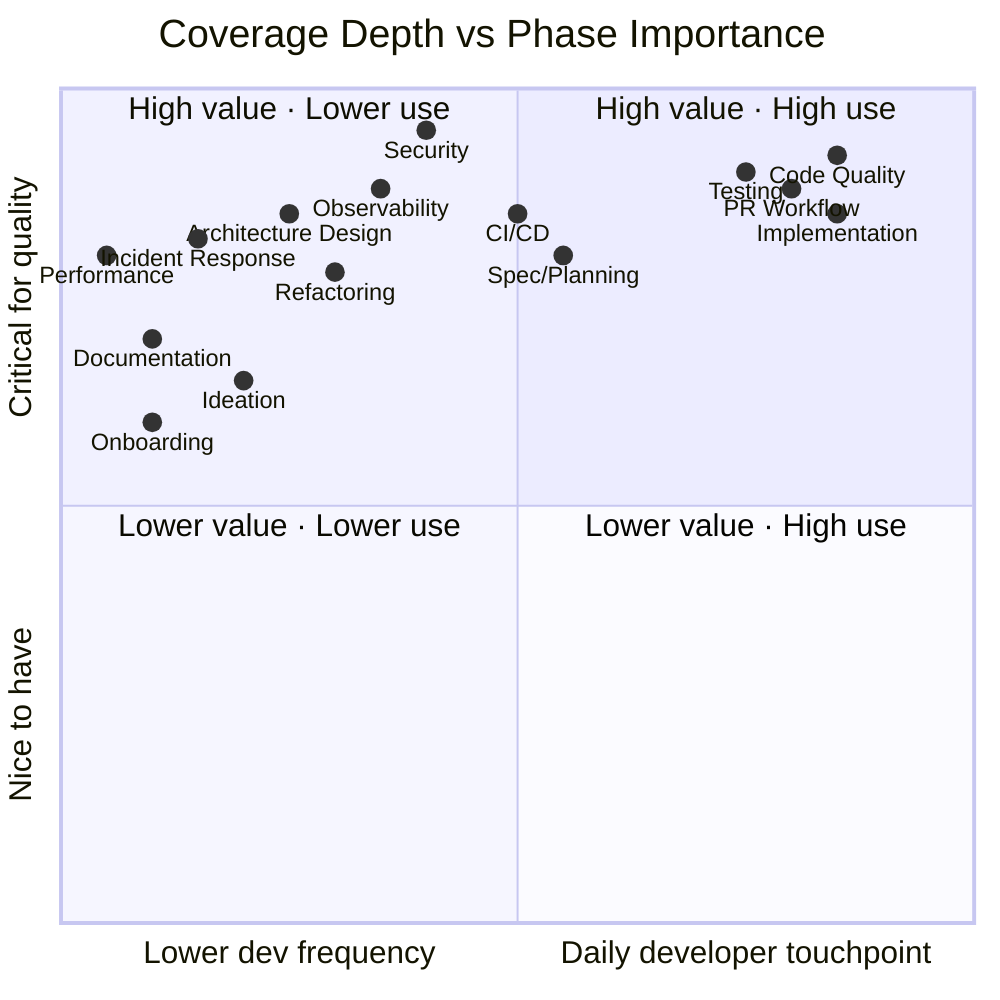
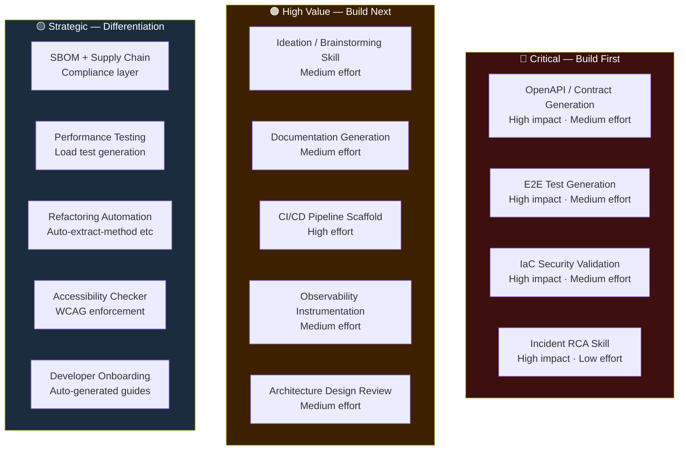
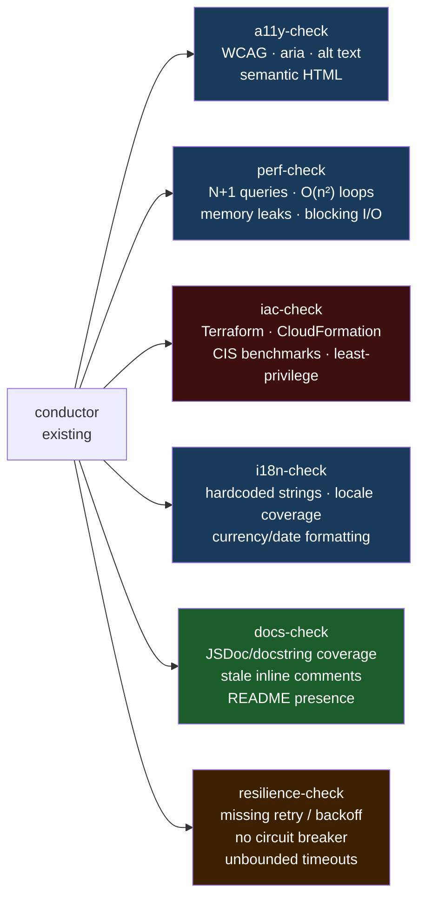
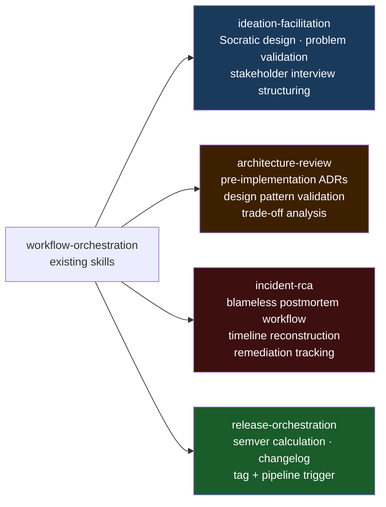
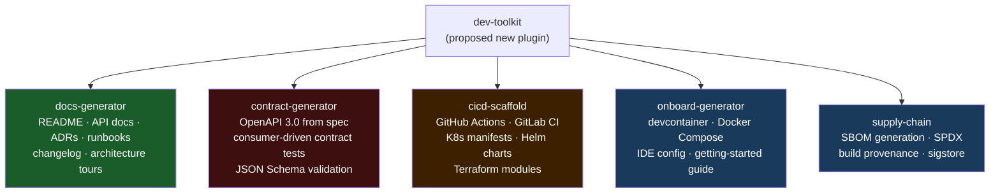
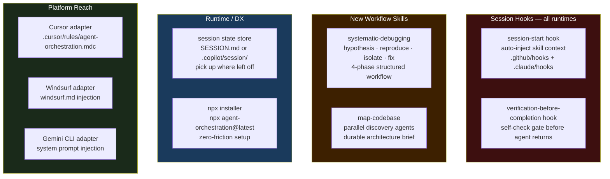
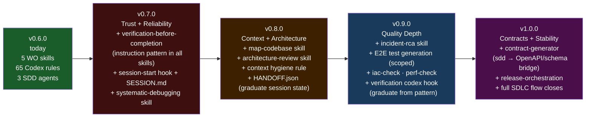
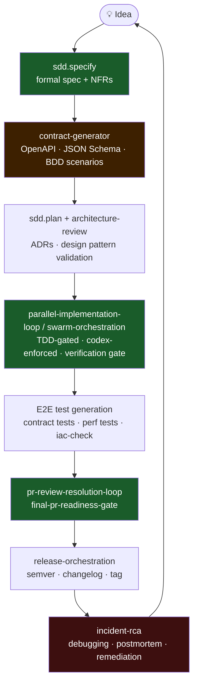

# SDLC Gap Analysis

Where `agent-orchestration` sits today in the full modern software development lifecycle — what is covered, what is missing, why it matters, and where to go next.

---

## Current Coverage Snapshot

Three plugins, 21 skills/sub-skills, covering roughly the middle third of the SDLC:

---

## Full SDLC Coverage Heatmap

Each cell shows: **our coverage level** for that phase.

> **How to read:** Items in the top-right quadrant are **high-value daily touchpoints we don't fully cover** — the biggest gaps.

---

## Phase-by-Phase Gap Analysis

### 1 — Discovery / Ideation

| | |
|---|---|
| **Covered** | Nothing |
| **Missing** | Socratic design questioning, problem/opportunity validation, stakeholder interview structuring, competitive framing |
| **Priority** | 🟠 High |

**Why it matters:** 30–40% of scope drift starts here — solving the wrong problem. A Socratic ideation skill that challenges assumptions, surfaces constraints, and forces alternatives *before* the spec is written would prevent expensive mid-course corrections. It's the cheapest place to catch a bad idea.

---

### 2 — Requirements / Specification

| | |
|---|---|
| **Covered** | `sdd.specify` → formal spec + requirements checklist |
| **Missing** | Non-functional requirements (NFRs), BDD/Gherkin acceptance criteria, API contract specs (OpenAPI), compliance extraction (GDPR, PCI, HIPAA), risk/assumption registries |
| **Priority** | 🔴 Critical |

**Why it matters:** Well-written features still often lack NFRs and structured acceptance criteria, leading to misaligned implementations. Auto-generating OpenAPI specs and BDD scenarios from `sdd.specify` output would prevent interface drift. For regulated industries, auto-extracting compliance requirements would shift legal review earlier and cheaper.

---

### 3 — Architecture / Design

| | |
|---|---|
| **Covered** | `arch-check` enforces violations *after* code is written; `planning-orchestration` does codebase discovery |
| **Missing** | Upfront ADR generation, design pattern selection, interface contract definition, sequence diagram generation, technology trade-off analysis, schema/data model design |
| **Priority** | 🟠 High |

**Why it matters:** Architecture decisions made implicitly during implementation are expensive to reverse. A pre-implementation design review skill — with domain agents for performance, security, and maintainability — would catch structural problems at the lowest possible cost. `arch-check` is a rear-view mirror; we need a windshield.

---

### 4 — Implementation

| | |
|---|---|
| **Covered** | `parallel-implementation-loop`, `tdd-check`, `type-check`, `naming-check`, `size-check`, auto-hooks (SEC-1, ARCH-1, SIZE-1) |
| **Missing** | Boilerplate/scaffold generation from specs, refactoring automation (extract method, rename), accessibility (a11y/WCAG) checks, i18n setup, resilience pattern scaffolding (retry, circuit breaker, backoff) |
| **Priority** | 🟡 Medium |

**Why it matters:** AI writes code faster than humans but still produces boilerplate inconsistently. A skill that generates CRUD layers, middleware stacks, or ORM queries from an OpenAPI spec would 10x implementation velocity. Accessibility and resilience patterns are always added "later" — enforcing them at write time makes them free.

---

### 5 — Testing

| | |
|---|---|
| **Covered** | `tdd-check` (TDD-1–9), `test-check` (TEST-1–8), TEST-DELTA hook, `sec-check` for security patterns |
| **Missing** | E2E test generation (Cypress/Playwright from specs), integration/contract testing, performance/load tests, chaos/resilience tests, mutation testing, test data generation, visual regression |
| **Priority** | 🔴 Critical |

**Why it matters:** AI-generated code includes unit tests but systematically skips integration, performance, and security tests. Auto-generating E2E tests from feature specs, consumer-driven contract tests, and OWASP attack-vector tests would catch an entire class of bugs that unit tests miss. Performance tests written *at feature time* (not as an afterthought) prevent production surprises.

---

### 6 — Code Quality / Review

| | |
|---|---|
| **Covered** | `pr-review-resolution-loop`, `final-pr-readiness-gate`, full `clean-code-codex` suite (65 rules), auto-hooks |
| **Missing** | Cyclomatic/cognitive complexity scoring, duplication/clone detection, API doc completeness (JSDoc/Javadoc), code smell detection beyond the 65 rules, git churn analysis |
| **Priority** | 🟡 Medium (strong baseline; targeted gaps only) |

**Why it matters:** Review feedback is often subjective. Adding quantitative complexity scoring and duplication detection would make review verdicts objective and actionable. API documentation completeness is a chronic DX gap — auto-enforcing it would improve library adoption and reduce support friction.

---

### 7 — Security

| | |
|---|---|
| **Covered** | `sec-check` (SEC-1–7): secrets, injection, auth, TLS, crypto, token handling, bash injection hook |
| **Missing** | IaC security scanning (Terraform/CloudFormation vs CIS benchmarks), container/image scanning, SBOM generation, supply chain provenance, PII/data classification, IAM policy validation, cryptographic agility |
| **Priority** | 🔴 Critical |

**Why it matters:** The 7 sec-check rules cover the most egregious code-level patterns but the attack surface extends far beyond code. Cloud misconfigurations (exposed S3, over-permissive IAM) cause more breaches than SQL injection today. Auto-validating Terraform against CIS benchmarks and generating SBOMs would cover the infrastructure layer that sec-check can't touch.

---

### 8 — Documentation

| | |
|---|---|
| **Covered** | Nothing dedicated — sdd artifacts are specs, not user-facing or operational docs |
| **Missing** | README generation, API docs (OpenAPI → rendered), ADR generation, runbook generation, onboarding guides, changelog from git history, diagram generation (C4/ER), dead-doc detection |
| **Priority** | 🟠 High |

**Why it matters:** Documentation is always last written and first outdated. A skill that auto-generates API docs from signatures, ADRs from design decisions, and runbooks from config files keeps docs in sync with code at zero marginal effort. Dead-doc detection removes misinformation that misleads future contributors.

---

### 9 — CI/CD / Release / Deployment

| | |
|---|---|
| **Covered** | Nothing |
| **Missing** | Pipeline scaffold generation (GitHub Actions, GitLab CI), release management (semver, tag, changelog), deployment orchestration (K8s manifests, Helm, Terraform), build optimization, IaC drift detection, feature flags, rollback automation |
| **Priority** | 🟠 High |

**Why it matters:** AI builds code but doesn't wire it to production. A skill that generates a complete GitHub Actions pipeline from project config (language, test commands, deploy target) would reduce "works on my machine" failures. Kubernetes manifest generation with correct resource limits and health probes would prevent common deploy-time outages.

---

### 10 — Observability / Monitoring

| | |
|---|---|
| **Covered** | `obs-check` (OBS-1–5): empty catches, logging patterns, error context, health check presence; OBS-1 auto-hook |
| **Missing** | Instrumentation generation (structured logs, OpenTelemetry spans, Prometheus metrics), SLO/SLI definition, alert rule generation, distributed tracing setup, cost monitoring, APM integration |
| **Priority** | 🟠 High |

**Why it matters:** `obs-check` flags missing observability but can't add it. A skill that auto-generates structured logging calls, OpenTelemetry spans, and Prometheus metric definitions would ship code with "observability by default." SLO/SLI generation from requirements would align monitoring with business expectations from day one.

---

### 11 — Incident Response / Debugging

| | |
|---|---|
| **Covered** | `sec-check` + `obs-check` trigger on incident; `final-pr-readiness-gate` catches pre-release risks |
| **Missing** | Structured debugging workflow (hypothesis-driven), RCA methodology (blameless postmortem), incident timeline reconstruction, runbook generation, chaos engineering, circuit breaker validation, MTTR reduction |
| **Priority** | 🟠 High |

**Why it matters:** When production breaks, developers need rapid structured diagnosis. A skill that walks through hypothesis → test → observe, reconstructs timelines from logs, and generates blameless RCA templates would compress MTTR by 50% and prevent recurrence. Chaos experiment generation would validate resilience *before* the incident.

---

### 12 — Dependency Management

| | |
|---|---|
| **Covered** | `dep-check` (DEP-1–5): CVEs, version lag, misclassified deps, unpinned versions; DEP-1 auto-hook |
| **Missing** | Upgrade automation (major/minor/patch strategies), transitive CVE fixup, lock file validation, supply chain security, license compliance scanning, SPDX SBOM generation, bundle size impact analysis |
| **Priority** | 🟡 Medium (good baseline; automation layer missing) |

**Why it matters:** `dep-check` identifies problems but can't fix them. A skill that auto-generates upgrade PRs with test validation, batches minor/patch security updates, and flags transitive CVEs would reduce security debt from weeks to hours. License compliance automation would prevent legal exposure in open-source usage.

---

### 13 — Onboarding / Developer Experience

| | |
|---|---|
| **Covered** | Nothing |
| **Missing** | Getting-started guide generation, dev environment setup automation (devcontainers, Docker Compose), codebase architecture tour, common task runbooks, contribution guidelines, IDE config generation |
| **Priority** | 🟡 Medium |

**Why it matters:** Onboarding friction compounds — every new contributor who spends days setting up is wasted productivity. A skill that auto-generates getting-started guides, devcontainer configs, and architecture tours from codebase metadata would reduce time-to-first-commit from days to hours. For distributed teams, standardized IDE configs would eliminate "works on my machine" debates.

---

### 14 — Refactoring / Technical Debt

| | |
|---|---|
| **Covered** | `size-check` warns, `dead-check` warns, `naming-check` warns, `arch-check` warns — all on refactor; `tdd-check` gates |
| **Missing** | Automated refactoring (extract method, rename, move class), tech debt quantification (SQALE scoring), complexity reduction suggestions, legacy code modernization, flaky test fixes, performance profiling |
| **Priority** | 🟡 Medium |

**Why it matters:** The codex suite diagnoses tech debt well but can't remediate it. A skill that auto-applies safe refactorings (extract function, rename, inline) and tracks a debt registry would prevent codebase decay. SQALE scoring would let teams prioritize debt paydown by business impact rather than gut feeling.

---

## Gap Heatmap — Impact vs Effort

---

## Proposed New Checks for clean-code-codex

The codex architecture (conductor + sub-skills) is the natural home for new enforcement checks. Each of these is a discrete add:

---

## Proposed New workflow-orchestration Skills

These are coordination-level skills, not rules — they belong in `workflow-orchestration`:

---

## Proposed New Standalone Plugin — `dev-toolkit`

Some capabilities don't fit the existing plugin shapes and warrant a fourth plugin:

---

## Competitor-Inspired Features (Not Covered Above)

The SDLC phase analysis above covers *what* developers build. These items from the [competitor comparison](./competitor-comparison.md) are about *how the agent runtime itself works* — session lifecycle, discoverability, and platform reach. All nine were identified as gaps worth taking; none made it into the SDLC sections.

### From Superpowers

| Feature | What it does | Our gap | Priority |
|---|---|---|---|
| **Session-start hook** | Loads all skill context automatically at session start; skills are always primed | We require explicit invocation or pattern-match. Skills not loaded = skills not used. | 🔴 High |
| **Verification-before-completion** | Anti-hallucination gate: agent self-checks output validity before returning it | No equivalent. AI-generated results can be confidently wrong with no blocking check. | 🔴 High |
| **Systematic debugging** (4-phase) | Structured hypothesis → reproduce → isolate → fix workflow | Only partially addressed in `incident-rca`. Not a named, invocable skill. | 🟠 High |

### From GSD

| Feature | What it does | Our gap | Priority |
|---|---|---|---|
| **Map-codebase command** | Parallel multi-agent codebase discovery: architecture tour, dependency graph, hotspots, entry points | `planning-orchestration` has a per-task scout pass but no standalone shareable codebase brief | 🟠 High |
| **Pause/resume session state** | Persists work-in-progress across conversations; agent picks up exactly where it left off | No session state. Complex work spanning conversations is restarted from scratch. | 🟠 High |
| **npx / one-line installer** | `npx get-shit-done-cc@latest` — zero friction setup across any machine | Install requires git clone + copy steps. High friction kills adoption. | Post-1.0 |
| **Runtime hooks** (4 types) | `context-monitor`, `workflow-guard`, `statusline`, `prompt-guard` fire automatically | 8 codex hooks exist but no session-level orchestration hooks | 🟡 Medium |

### Cross-Cutting: Platform Reach

> **Scope note:** Claude Code and GitHub Copilot CLI are the only targets until post-1.0. The items below are documented for completeness but are explicitly deferred.

| Feature | What it does | Our gap | Status |
|---|---|---|---|
| **Cursor support** | Skills surfaced in Cursor (`.cursor/rules`) | Only Copilot CLI + Claude Code | Post-1.0 |
| **Windsurf support** | Skills surfaced in Windsurf (`windsurf.md`) | Not supported | Post-1.0 |
| **Gemini CLI support** | Skills surfaced in Google's Gemini CLI | Not supported | Post-1.0 |
| **Versioned plugin packaging** | Semver-locked installs, changelogs surfaced at install | Packaging ships code but version isn't surfaced cleanly to users | Post-1.0 |

---

## Competitor Features — Implementation Map

Where each of these would actually live:

---

## Updated Roadmap — Version Milestones

> **Scope:** Claude Code and GitHub Copilot CLI only. Platform adapters (Cursor, Windsurf, Gemini CLI) and npx installer are post-1.0 work.

### Rationale

| Version | Theme | Why this order |
|---|---|---|
| v0.7.0 | Trust + Reliability | Correctness and context loss are the #1 daily pain. Every session and every skill output benefits. Lowest implementation risk — hooks and instruction patterns, no fragile artifact generation. |
| v0.8.0 | Context + Architecture | Once sessions are reliable, the next bottleneck is wrong-direction turns. Upfront codebase understanding and architecture validation prevent expensive rework. |
| v0.9.0 | Quality Depth | Extends coverage into high-value but lower-frequency concerns. Incident debugging, E2E, IaC security. Graduates verification from instruction pattern to passive codex hook backed by real usage evidence. |
| v1.0.0 | Contracts + Stability | Contracts close the spec→implementation gap. Release orchestration closes the merge→ship gap. Together they complete the core loop. |

### Deferred Post-1.0

| Item | Reason for deferral |
|---|---|
| Cursor / Windsurf / Gemini CLI adapters | Out of scope — Claude Code + Copilot CLI only until post-1.0 |
| npx / one-line installer | Platform adoption concern; premature before core quality is proven |
| `cicd-scaffold` | Too fragile and system-specific; high risk of generating broken pipelines |
| `observability instrumentation generation` | Extremely system-specific; existing tools (OTel SDKs) do this better |
| `docs-generator` | Low-leverage; rarely the bottleneck in software quality |
| `onboard-generator` | Useful but not a blocker for any core workflow |

---

## What This Unlocks at v1.0.0

Claude Code and GitHub Copilot CLI — full loop from idea to shipped, verified code.

---

## Summary Table

| SDLC Phase | Current Coverage | Gap Severity | Roadmap Target |
|---|---|---|---|
| Requirements / Spec | ✅ `sdd.specify` | 🔴 Critical (NFRs, contracts) | v1.0.0 `contract-generator` |
| Architecture / Design | 🟡 Post-hoc only | 🟠 High | v0.8.0 `architecture-review` |
| Implementation | ✅ Strong | 🟡 Medium | — |
| Testing | 🟡 Unit/TDD only | 🔴 Critical (E2E, perf, contract) | v0.9.0 E2E generator, `perf-check` |
| Code Quality | ✅ Strong (65 rules) | 🟡 Low | — |
| Security | 🟡 Code-level only | 🔴 Critical (IaC) | v0.9.0 `iac-check` |
| CI/CD / Deployment | ❌ None | 🟡 Low | Post-1.0 (fragile to generate) |
| Observability | 🟡 Pattern enforcement | 🟡 Low | Post-1.0 (system-specific) |
| Incident Response | 🟡 Reactive only | 🟠 High | v0.9.0 `incident-rca` |
| Dependency Mgmt | ✅ `dep-check` | 🟡 Medium | — |
| Performance | ❌ None | 🔴 Critical | v0.9.0 `perf-check` (runtime) |
| Documentation | ❌ None | 🟡 Low | Post-1.0 |
| Onboarding / DX | ❌ None | 🟡 Low | Post-1.0 |
| **Session-start hook** | ❌ None | 🔴 High | v0.7.0 |
| **Verification-before-completion** | ❌ None | 🔴 High | v0.7.0 (pattern) · v0.9.0 (hook) |
| **Systematic debugging** | ❌ None | 🟠 High | v0.7.0 |
| **Map-codebase** | 🟡 Per-task scout only | 🟠 High | v0.8.0 |
| **Session state (pause/resume)** | ❌ None | 🟠 High | v0.7.0 SESSION.md · v0.8.0 HANDOFF.json |
| **Cursor / Windsurf / Gemini** | ❌ None | — | Post-1.0 (out of scope) |
| **npx installer** | ❌ None | — | Post-1.0 (out of scope) |
